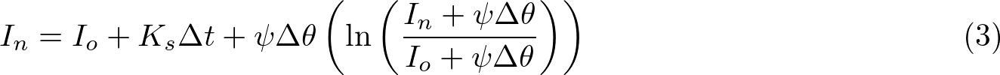
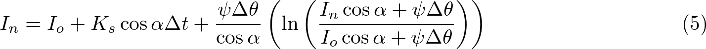
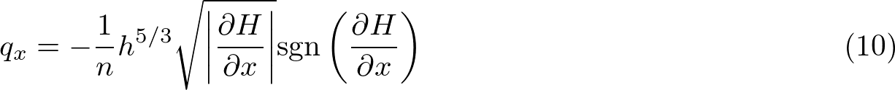
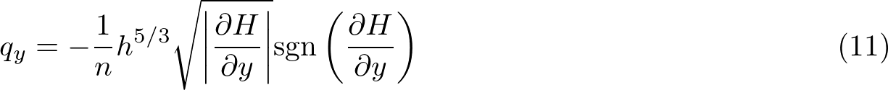
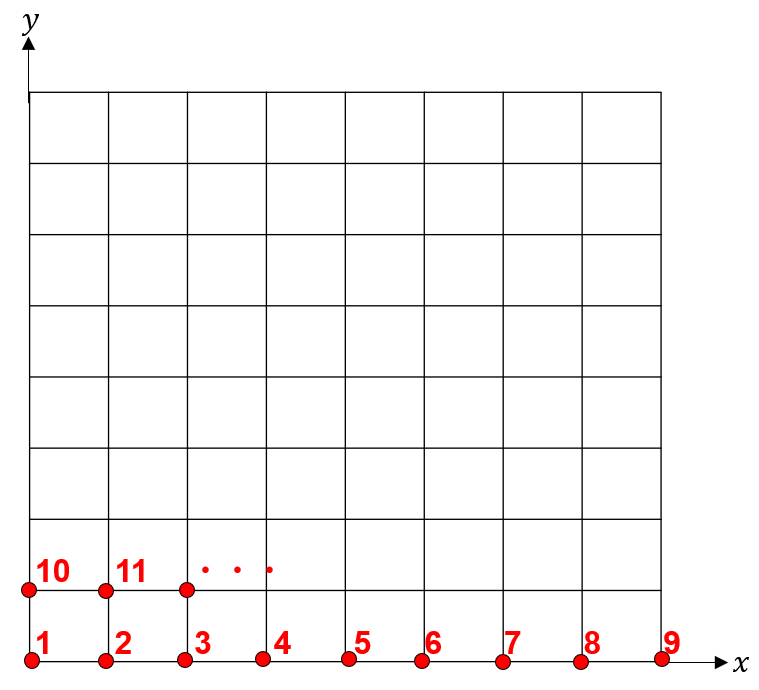

# 浸透・地表流解析に関するコード : Code for infiltration and surface flow analysis

Green-Amptモデルによる浸透解析と，Diffusion Waveモデルによる地表流解析を実行するfortranコード   
Fortran code for infiltration analysis by the Green-Ampt model and surface flow analysis by the diffusion wave model

具体的な式については，[Engineering Geologyの論文](https://doi.org/10.1016/j.enggeo.2022.106808)に記載   
Equations used in the code are written in [this paper](https://doi.org/10.1016/j.enggeo.2022.106808).    

### (※)注意 Attention   
論文中の式(3), (5), (10), (11) に誤植あり．以下が正しい式．   
Equations (3), (5), (10), and (11) in the paper are incorrect. The following Equations are correct.    
 
[Dolojan et al. (2021)](https://doi.org/10.1007/S10346-020-01617-X)や
[Sayama et al. (2012)](https://doi.org/10.1080/02626667.2011.644245)も参照   
Please see also [Dolojan et al. (2021)](https://doi.org/10.1007/S10346-020-01617-X) 
and [Sayama et al. (2012)](https://doi.org/10.1080/02626667.2011.644245).      

  

  
  
  
  
  


## 入力データ: Input data
 
### input/: 解析領域の座標データと解析パラメータ(Coordinates of analysis area and Parameters for analysis)

 - **coordinate.txt**       
  座標データ: 1列目にx座標，2列目にy座標，3列目に標高値   
  Coordinates data: x-coordinate (first column), y-coordinate (second column), and elevation (third column)   
  座標はグリッドを想定，以下の図に示す順番でデータを格納    
  The coordinates are arranged on a grid and arranged in order as shown in the following figure.    

  

 - **num_node.txt**   
  x,y方向の節点数: Number of nodes for x and y directions    

 - **inp_par.txt**   
  解析パラメータのデータを格納（空間的に一様なものとして仮定）   
  Values of analysis parameters  (Assumed as spatially uniform)    
  1行目(First row) ：飽和透水係数(Saturated hydraulic conductivity) (m/s)，Suction head at Wetting front (m)   
  2行目(Second row)：初期体積含水率，飽和体積含水率(Initial and saturated volumetric water content)   
  3行目(Third row) ：マニングの粗度係数 (s/m^(1/3))，地表流解析の実施有無(1:地表流計算なし, 2:あり)     
  Third row: Manning's roughness coefficient and 
  Flag for surface flow analysis (1: only infiltration analysis are performed. 2: infiltration and surface flow analysis are performed. )


### raindata/: 降雨データ(Rainfall data)

 - **rain.txt**   
  降水量の時空間分布データ(行方向：時間，列方向：空間，単位：m/s)     
  Spatiotemporal distribution data of precipitation. (Row direction: Time, Column direction: space, Unit: m/s)   
  空間的に一様な場合は1列のデータを作成    
  In the case of spatially uniform rainfall, create 1 column of data.    

 - **time_condition.txt**    
  降雨の時間ステップ数(=rain.txtの行数)と1つの時間ステップの時間間隔(s)     
  Number of time steps (equal to the number of columns of rain.txt) and time interval for rainfall data.  
  設定した時間間隔で結果も出力    
  Results are output at set time intervals. 

 - **coordinate_rain.txt**   
  降水量の座標データ: Coordinates for rainfall data  
  

## コード内の主な変数: Main variables in the code

 - **座標・時間変数 (Coordinates and time variables)**     

 | 変数名(Variable name) | 次元(Dimension) |単位(Unit) | 説明(Description)           |   
 | :------: | :----: | :----: | :-------------                            |   
 | nx, ny   | -      | -      | x,y方向の節点数，途中から要素数を表現 (Number of nodes for x and y direction, Express the number of elements from the middle of the code.) |   
 | xx (yy)  | nx (ny) | [m]   | x,y方向の座標 (Coordinates for x and t direction)   |   
 | gl       | nx×ny   | [m]   | 標高値の行列 (A matrix of elevation data)           |   
 | dx, dy   | -       | [m]   | x,y方向の解像度 (Resolution of x and y direction)   |   
 | nti      | -       | -     | 計算の総時間ステップ数 (Number of total time steps)  |   
 | tstep    | -       | -     | 時間ステップ数 (Number of time steps)               |    
 | dti      | -       | [s]   | 降雨データの時間間隔(出力値の時間間隔) (Time intervals for rainfall data) |    
 | dt       | -       | [s]   | 解析の時間間隔 (Time interval for calculation)      |    
 | slp      | nx×ny   | -     | 斜面勾配 (slope gladient)                          |    


 - **降水量データ (Rainfll data)**      

 | 変数名(Variable name) | 次元(Dimension) |単位(Unit) | 説明(Description)           |   
 | :------: | :----: | :----: | :-------------                            |   
 | nr       | -      | -      | 降水量データの空間次元数 (Number of spatial dimension for rainfall data) |   
 | rain     | nti×nr | [m/s]  | 降水量の時空間分布 (Spatiotemporal distribution data of precipitation)  |   
 | raint    | nr     | [m/s]  | ある時間での降水量 (Precipitation at a certain time)             |    
 | rid      | nx×ny  | -      | 各計算点が参照する降水量データの番号 (Number for precipitation data to which each calculation point refers) |   


 - **浸透解析 (Variables for infiltration analysis)**     

 | 変数名(Variable name) | 次元(Dimension) |単位(Unit) | 説明(Description)        |   
 | :------: | :----: | :----: | :-------------                                   |   
 | k0       | -      | [m/s]  | 飽和透水係数 (Saturated hydraulic conductivity)   |    
 | thi, ths | -      | [-]    | 初期(飽和)体積含水率 (Initial and saturated volumatric water content) |    
 | psi      | -      | [m]    | Suction Head at Wetting front     |    
 | fn       | nx×ny  | [m]    | ある時間での累積浸透量 (Cumurative infiltration)          |    
 | zzn      | nx×ny  | [m]    | 鉛直方向の浸透深さ (Vertical depth of the wetting front)  |    


 - **地表流解析 (Variables for surface flow analysis)**     

 | 変数名(Variable name) | 次元(Dimension) |単位(Unit) | 説明(Description)           |   
 | :------: | :----: | :----:      | :-------------                            |   
 | qsx,qsy  | 2      | [m^2/s]     | x(y)方向の単位幅流量 (Unit width flow rate for x and y direction)   |    
 | nn       | -      | [s/m^(1/3)] | マニングの粗度係数 (Manning's roughness coefficient)      |    
 | hsn      | nx×ny  | [m]         | 地表水位 (Surface flow level)                            |    
 | hmx      | nx×ny  | [m]         | 地表水位の最大値 (Maximum surface flow level)             |    


## 計算方法

 予めoutputフォルダを作成しておく必要あり    
 Create output directory before calculation.        

 - コンパイル：Compile (gfortran)    
  
 シングル計算: Single calculation    

 ```
 gfortran infil_sflow.f90 -o run    
 ```

 並列化(OpenMP): Parallelization   

 ```
 gfortran -fopenmp infil_sflow.f90 -o run 
 ```

 - 実行: Running      

 ```
 ./run    
 ```

## 出力データ: Output data   
 
 - water-depth-level_****.txt    
  出力結果：各要素の値として出力（=num_nodeで設定した数より1ずつ小さい空間次元）   
  Output results: Output results for each element. (The number of spatial dimensions that is 1 less than the number set in num_node.txt)    
  ****は時間ステップ番号(0001,0002,...)   
  **** represents time step number (0001,0002,...)
  1列目(First row)：x座標 x-coordinates  
  2列目(Second row)：y座標 y-coordinates    
  3列目(Third row)：Wetting front depth (m)   
  4列目(Fourth row)：地表水位 Surface flow level (m)    

 - max_s_water_level.txt   
   地表水位の最大値のデータ    
   Maximum surface flow level (m)    
   地表流計算を実施した時のみ出力     
   Output only when surface flow calculations are performed.    


## 参考文献: References   
 - [K.Tozato et al.(2022)](https://doi.org/10.1016/j.enggeo.2022.106808), Limit equilibrium method-based 3D slope stability analysis for wide area considering influence of rainfall, Engineering Geology, Vol. 308, pp. 106808.      
 - [N. L. J. Dolojan et al. (2021)](https://doi.org/10.1007/S10346-020-01617-X), Mapping method of rainfall-induced landslide hazards by infiltration and slope stability analysis, Landslides, Vol. 6, pp. 2039–2057. 
 - [Sayama et al. (2012)](https://doi.org/10.1080/02626667.2011.644245), Rainfall-runoffinundation analysis of the 2010 Pakistan flood in the Kabul river basin. Hydrol. Sci. J., Vol. 57, pp. 298–312. 


